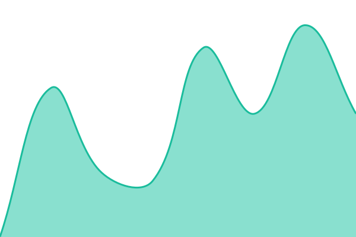
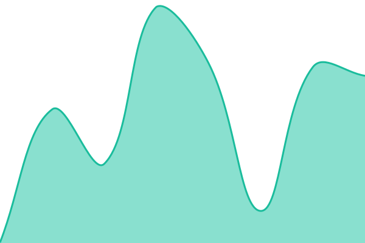
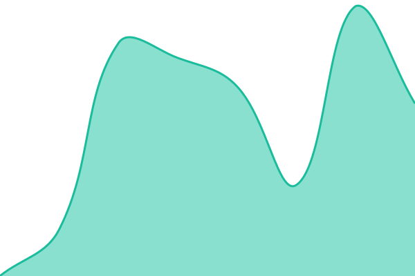

# [📈 Live Status](https://status.summitdata.us): <!--live status--> **🟩 All systems operational**

This repository contains the open-source uptime monitor and status page for [espressojuice](https://status.summitdata.us), powered by [Upptime](https://github.com/upptime/upptime).

With [Upptime](https://upptime.js.org), you can get your own unlimited and free uptime monitor and status page, powered entirely by a GitHub repository. We use [Issues](https://github.com/espressojuice/summit-status/issues) as incident reports, [Actions](https://github.com/espressojuice/summit-status/actions) as uptime monitors, and [Pages](https://status.summitdata.us) for the status page.

<!--start: status pages-->
<!-- This summary is generated by Upptime (https://github.com/upptime/upptime) -->
<!-- Do not edit this manually, your changes will be overwritten -->
<!-- prettier-ignore -->
| URL | Status | History | Response Time | Uptime |
| --- | ------ | ------- | ------------- | ------ |
|  [Summit Data](https://summitdata.us) | 🟩 Up | [summit-data.yml](https://github.com/espressojuice/summit-status/commits/HEAD/history/summit-data.yml) | 

 461ms
     
 | 

<a href="https://status.summitdata.us/history/summit-data">100.00%</a>
    

|  [SmartPull](https://smartpull.io) | 🟩 Up | [smart-pull.yml](https://github.com/espressojuice/summit-status/commits/HEAD/history/smart-pull.yml) | 

 253ms
     
 | 

<a href="https://status.summitdata.us/history/smart-pull">100.00%</a>
    

|  [FlipHive](https://fliphive.ai) | 🟩 Up | [flip-hive.yml](https://github.com/espressojuice/summit-status/commits/HEAD/history/flip-hive.yml) | 

 994ms
     
 | 

<a href="https://status.summitdata.us/history/flip-hive">100.00%</a>
    

|  [StorageHub](https://storagehub.ai) | 🟩 Up | [storage-hub.yml](https://github.com/espressojuice/summit-status/commits/HEAD/history/storage-hub.yml) | 

 1394ms
     
 | 

<a href="https://status.summitdata.us/history/storage-hub">100.00%</a>
    

|  [YouTube Transcribe](https://youtube-transcribe.com) | 🟩 Up | [you-tube-transcribe.yml](https://github.com/espressojuice/summit-status/commits/HEAD/history/you-tube-transcribe.yml) | 

 249ms
     
 | 

<a href="https://status.summitdata.us/history/you-tube-transcribe">100.00%</a>
    

|  [LotGuard](https://lotguard-web.vercel.app) | 🟩 Up | [lot-guard.yml](https://github.com/espressojuice/summit-status/commits/HEAD/history/lot-guard.yml) | 

 422ms
     
 | 

<a href="https://status.summitdata.us/history/lot-guard">100.00%</a>
    

|  [StorageHub (staging)](https://storage-staging-sepia.vercel.app) | 🟩 Up | [storage-hub-staging.yml](https://github.com/espressojuice/summit-status/commits/HEAD/history/storage-hub-staging.yml) | 

 1269ms
     
 | 

<a href="https://status.summitdata.us/history/storage-hub-staging">100.00%</a>
    

<!--end: status pages-->

[**Visit our status website →**](https://status.summitdata.us)

## 📄 License

- Powered by: [Upptime](https://github.com/upptime/upptime)
- Code: [MIT](./LICENSE) © [Anand Chowdhary](https://anandchowdhary.com)
- Data in the `./history` directory: [Open Database License](https://opendatacommons.org/licenses/odbl/1-0/)
